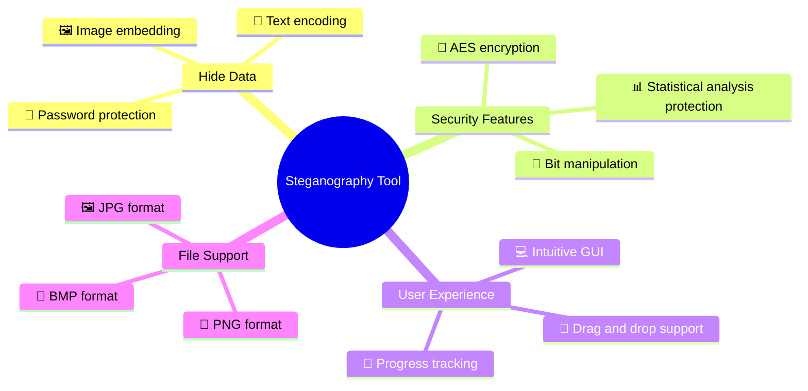
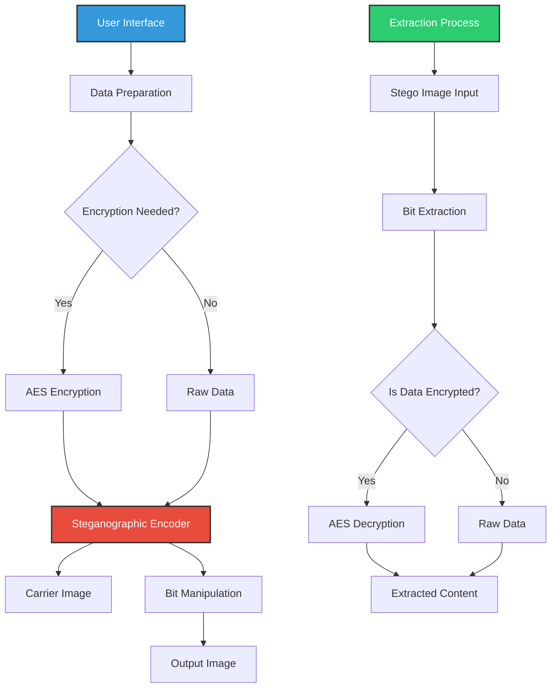

# 🔒 Steganography Tool+Detector v2.1

<div align="center">


[](https://www.python.org/)
[](LICENSE)
[](https://github.com/elithaxxor/Steganography-Tool)
[](https://docs.python.org/3/library/tkinter.html)

**Hide secrets in plain sight with advanced steganography techniques**

</div>

<p align="center">
This powerful steganography application allows you to securely hide sensitive information within ordinary image files. With an intuitive GUI interface and support for multiple encryption methods, you can safeguard your data while making it virtually undetectable to casual observers.
</p>

---

## 📋 Table of Contents

- [✨ Features](#-features)
- [🖼️ Screenshots](#-screenshots)
- [🌟 Why Steganography?](#-why-steganography)
- [⚙️ Installation](#️-installation)
- [🚀 Quick Start](#-quick-start)
- [📱 Usage Guide](#-usage-guide)
- [🔐 Encryption Methods](#-encryption-methods)
- [💻 Technical Details](#-technical-details)
- [⚠️ Security Considerations](#️-security-considerations)
- [📊 Supported Formats](#-supported-formats)
- [🧩 Requirements](#-requirements)
- [🛠️ Troubleshooting](#️-troubleshooting)
- [🤝 Contributing](#-contributing)
- [📜 License](#-license)
- [👤 Author](#-author)

---

## ✨ Features

<div align="center">



</div>

- **🖼️ Multiple Carrier Types**: Hide data in various image formats (PNG, JPG, BMP)
- **🔐 Encryption Support**: Add password protection with AES-256 encryption
- **💻 User-Friendly Interface**: Intuitive GUI with drag-and-drop functionality
- **📊 Statistical Resistance**: Advanced techniques to resist statistical analysis
- **📱 Cross-Platform**: Works on Windows, macOS, and Linux
- **🧩 Multiple Hiding Methods**: LSB (Least Significant Bit), DCT (Discrete Cosine Transform), and more
- **📄 Text & File Support**: Hide both text messages and binary files
- **🔍 Detection Prevention**: Minimal visual changes to carrier images
- **🔄 Batch Processing**: Process multiple files at once
- **📋 Capacity Analysis**: Calculate available hiding capacity before embedding
- **🔧 Customizable Settings**: Adjust embedding strength, distribution, and more

---

## 🖼️ Screenshots

<div align="center">
  <p><strong>Main Application Interface</strong></p>
  
  
  <p><strong>Embedding Process</strong></p>
  
  
  <p><strong>Extraction Results</strong></p>
  
</div>

---

## 🌟 Why Steganography?

<div align="center">

| Encryption Alone | Steganography + Encryption |
|------------------|----------------------------|
| ❌ Data is visibly encrypted | ✅ Data is completely hidden |
| ❌ Attracts attention | ✅ Appears as normal files |
| ❌ Confirms data exists | ✅ Provides plausible deniability |
| ❌ Single security layer | ✅ Multiple security layers |

</div>

Steganography offers a powerful complement to traditional encryption by hiding the very existence of your sensitive data. While encryption scrambles your information making it unreadable without the key, it also signals that you have something to hide. Steganography takes security to the next level by concealing data within ordinary-looking files that raise no suspicion.

> 💡 **Did you know?** The word "steganography" comes from the Greek words "steganos" (covered or hidden) and "graphein" (writing).

---

## ⚙️ Installation

### Prerequisites
- Python 3.7 or higher
- pip (Python package manager)

### Method 1: From Source (Recommended)

```bash
# Clone the repository
git clone https://github.com/elithaxxor/Steganography-Tool.git

# Navigate to the project directory
cd Steganography-Tool/GUI

# Install dependencies
pip install -r requirements.txt

# Launch the application
python stego_gui.py
```

### Method 2: Using pip (Coming Soon)

```bash
# Install from PyPI
pip install stego-tool

# Launch the application
stego-tool
```

<details>
<summary>📦 View dependencies</summary>

```
Pillow>=8.0.0
numpy>=1.19.0
cryptography>=3.4.0
tkinter>=8.6.0
matplotlib>=3.3.0
tqdm>=4.60.0
```
</details>

---

## 🚀 Quick Start

### Hiding Data

1. Launch the application
2. Select "Embed Data" mode
3. Choose a carrier image file
4. Select data to hide or enter text message
5. Set a password (optional but recommended)
6. Click "Embed" and save your output image

### Extracting Data

1. Launch the application
2. Select "Extract Data" mode
3. Open an image containing hidden data
4. Enter the password (if used during embedding)
5. Click "Extract" and save the retrieved data

---

## 📱 Usage Guide

### Text Mode

<div align="center">

```
┌─────────────────────────────────┐
│         Steganography Tool      │
├─────────────────────────────────┤
│ ╔═══════════════════════════════╗
│ ║ Enter text to hide:          ▼║
│ ║ This is my secret message...   ║
│ ║                                ║
│ ║                                ║
│ ╚═══════════════════════════════╝
│                                  │
│ [ ] Use encryption               │
│ [Password: **********         ]  │
│                                  │
│ [Select Carrier Image]           │
│                                  │
│ [▓▓▓▓▓▓▓▓▓▓▓▓▓▓▓▓▓▓     ] 75%   │
│                                  │
│ [   Embed   ]    [   Cancel   ]  │
└─────────────────────────────────┘
```

</div>

1. Select the "Text" tab
2. Enter your secret message
3. Toggle encryption if desired
4. Choose a carrier image
5. Click "Embed" to generate your steganographic image

### File Mode

1. Select the "File" tab
2. Click "Select File" to choose a file to hide
3. Toggle encryption if desired
4. Choose a carrier image with sufficient capacity
5. Click "Embed" to generate your steganographic image

### Advanced Options

<details>
<summary>🛠️ Click to expand advanced options</summary>

- **Embedding Method**: Choose between LSB, DCT, or Wavelet embedding
- **Bit Depth**: Select how many bits to use per pixel (1-4)
- **Distribution Pattern**: Choose random or sequential pixel selection
- **Custom Password Salt**: Add an additional salt value for enhanced security
- **Compression Level**: Compress data before hiding to increase capacity
- **Error Correction**: Add Reed-Solomon error correction for resilience

</details>

---

## 🔐 Encryption Methods

Our tool implements multiple layers of security:

### LSB (Least Significant Bit) Steganography

<div align="center">

```
Original Pixel: 10101100 10110101 11101011
                       ↓         ↓        ↓
                       1         0        1  <- Secret bits
                       ↓         ↓        ↓
Modified Pixel: 10101101 10110100 11101011
                       ↑         ↑        ↑
                  Changed    Changed   Unchanged
```

</div>

LSB steganography modifies the least significant bits of pixel values in an image to store hidden data. These changes are imperceptible to the human eye but can be extracted with the right software.

### Additional Security Features

- **🔑 AES-256 Encryption**: Military-grade encryption for your hidden data
- **🧂 Password Salting**: Protection against rainbow table attacks
- **🔄 Bit Shuffling**: Randomized bit distribution throughout the image
- **📊 Steganalysis Resistance**: Techniques to avoid detection by statistical analysis

---

## 💻 Technical Details

<div align="center">



</div>

### Embedding Algorithm

1. **Preparation Phase**:
   - Calculate carrier capacity
   - Prepare message/file data
   - Apply compression if needed
   - Encrypt data if password is provided

2. **Encoding Phase**:
   - Determine optimal bit distribution
   - Convert data to binary representation
   - Generate pseudorandom pixel sequence if using random distribution
   - Modify carrier image pixels according to chosen algorithm

3. **Finalization Phase**:
   - Add metadata (if necessary)
   - Apply filtering to reduce detection probability
   - Save output image in chosen format

### Extraction Algorithm

1. **Reading Phase**:
   - Load suspected carrier image
   - Determine embedding method (from metadata or user input)
   - Generate same pseudorandom sequence if needed

2. **Decoding Phase**:
   - Extract binary data from pixels
   - Reconstruct original data structure
   - Decrypt if necessary
   - Decompress if necessary

3. **Delivery Phase**:
   - Validate extracted data integrity
   - Present data to user or save to file

---

## ⚠️ Security Considerations

- **🔍 Plausible Deniability**: While steganography hides data, sophisticated steganalysis tools may detect that an image contains hidden information
- **🔒 Password Strength**: Your data security heavily depends on password complexity
- **💾 Original Images**: Comparison with original carrier images can reveal modifications
- **📤 Transmission Security**: Secure your communication channels when sending steganographic images
- **🔄 Format Conversion**: Converting between image formats may corrupt or destroy hidden data

---

## 📊 Supported Formats

### Carrier Image Formats

| Format | Support Level | Notes |
|--------|---------------|-------|
| PNG | ★★★★★ | Best option for steganography, lossless compression |
| BMP | ★★★★☆ | Excellent for steganography, but large file size |
| TIFF | ★★★★☆ | Good support, lossless but less common |
| JPG | ★★☆☆☆ | Limited support due to lossy compression |
| GIF | ★★☆☆☆ | Limited support, best for small data payloads |

### Hidden Content Formats

- **Text**: UTF-8 encoded text messages
- **Documents**: PDF, DOCX, TXT, etc.
- **Images**: PNG, JPG, GIF, etc.
- **Archives**: ZIP, RAR, 7Z, etc.
- **Any Binary Data**: All file types supported (size dependent on carrier capacity)

---

## 🧩 Requirements

- **Operating System**: Windows 10/11, macOS 10.15+, or Linux
- **Python**: Version 3.7 or higher
- **RAM**: Minimum 4GB (8GB+ recommended for large images)
- **Storage**: 100MB for application, additional space for images
- **Display**: 1280x720 or higher resolution

---

## 🛠️ Troubleshooting

<details>
<summary>Common Issues & Solutions</summary>

#### Cannot install dependencies
```bash
# Try upgrading pip first
python -m pip install --upgrade pip
# Then install with verbose output
pip install -v -r requirements.txt
```

#### "Unable to load carrier image" error
This typically occurs with corrupt image files or unsupported formats. Try:
- Converting the image to PNG format
- Using a different image file
- Checking file permissions

#### Extracted data is corrupted
- Ensure you're using the correct password
- Verify the image hasn't been modified or resaved in a different format
- Check if the original embedded data size exceeds carrier capacity

#### Application crashes during processing
- Try reducing the carrier image size
- Close other memory-intensive applications
- Update to the latest version of the tool
- Check system logs for specific error messages

</details>

---

## 🤝 Contributing

Contributions are welcome! Here's how you can help improve the Steganography Tool:

1. **Fork the Repository**: Create your own fork of the project
2. **Create a Feature Branch**: `git checkout -b feature/amazing-feature`
3. **Make Your Changes**: Add your improvements or fixes
4. **Run Tests**: Ensure all tests pass
5. **Commit Changes**: `git commit -m 'Add some amazing feature'`
6. **Push to Branch**: `git push origin feature/amazing-feature`
7. **Open a Pull Request**: Submit your changes for review

### 💡 Feature Ideas

- Mobile application version
- Support for audio/video steganography
- Blockchain-based verification system
- Cloud integration for secure storage
- Steganography detection tools
- Enhanced compression algorithms for larger payload capacity

---

## 📜 License

This project is licensed under the MIT License - see the [LICENSE](LICENSE) file for details.

---

## 👤 Author

<div align="center">
  
**Created by [elithaxxor](https://github.com/elithaxxor)**

[](https://github.com/elithaxxor)

<p>Created with ❤️ for the security and privacy community</p>

</div>

---

<p align="center">
  
</p>

<div align="center">

**[Documentation](https://github.com/elithaxxor/Steganography-Tool/wiki)** | 
**[Report Bug](https://github.com/elithaxxor/Steganography-Tool/issues)** | 
**[Request Feature](https://github.com/elithaxxor/Steganography-Tool/issues)**

<p align="center">
⭐ Star this repo if you found it useful! ⭐
</p>

</div>
