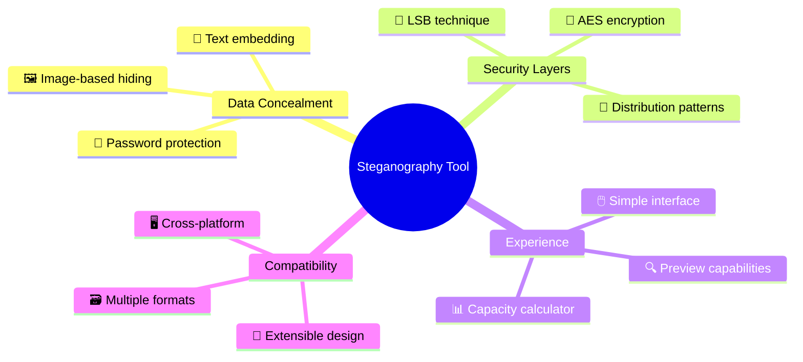
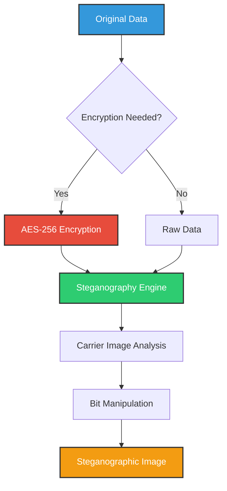

# 🔒 Steganography Tool v2.0 (GUI) 

<div align="center">


[](https://www.python.org/)
[](LICENSE)
[](https://github.com/elithaxxor/Steganography-Tool)
[](https://github.com/elithaxxor/Steganography-Tool)

**Conceal secrets in plain sight with advanced steganography techniques**

</div>

<p align="center">
This powerful steganography suite enables you to hide sensitive information within innocent-looking image files. Whether you're concerned about privacy, engaged in secure communications, or simply fascinated by cryptographic science, this tool provides the perfect balance of security and usability.
</p>

---

## 📋 Table of Contents

- [✨ Features](#-features)
- [🖼️ Screenshots](#-screenshots)
- [🎯 Why Use Steganography?](#-why-use-steganography)
- [🧩 Requirements](#-requirements)
- [⚙️ Installation](#️-installation)
- [🚀 Quick Start](#-quick-start)
- [📱 Usage Guide](#-usage-guide)
- [🔒 Security Details](#-security-details)
- [🔧 Supported Formats](#-supported-formats)
- [🔍 How It Works](#-how-it-works)
- [🛠️ Troubleshooting](#️-troubleshooting)
- [🤝 Contributing](#-contributing)
- [📜 License](#-license)
- [👤 Author](#-author)

---

## ✨ Features

<div align="center">



</div>

- **🔍 Multiple Hiding Techniques**: LSB (Least Significant Bit), DCT (Discrete Cosine Transform)
- **🔐 Strong Encryption**: AES-256 encryption to protect your hidden data
- **🖼️ Format Support**: Works with PNG, BMP, and JPEG images
- **📊 Capacity Analysis**: Calculate how much data can be hidden in an image
- **📂 File Embedding**: Hide any file type within compatible images
- **🔄 Batch Processing**: Process multiple files simultaneously
- **🖥️ Cross-Platform**: Compatible with Windows, macOS, and Linux
- **📱 Intuitive Interface**: User-friendly design for all experience levels
- **🔍 Minimal Footprint**: Changes to carrier images are virtually undetectable
- **🔒 Data Protection**: Multi-layered security for your sensitive information

---

## 🖼️ Screenshots

<div align="center">
  <p><strong>Main Application Interface</strong></p>
  
  
  <p><strong>Embedding Process</strong></p>
  
  
  <p><strong>Extraction Complete</strong></p>
  
</div>

---

## 🎯 Why Use Steganography?

Steganography offers unique security advantages that complement traditional encryption:

<div align="center">

| 🔒 Encryption Alone | 🔐 Steganography + Encryption |
|---------------------|-------------------------------|
| Makes data unreadable | Makes data invisible AND unreadable |
| Signals the presence of secrets | Provides plausible deniability |
| Single layer of protection | Multiple security layers |
| Vulnerable to forced disclosure | Hidden data can't be forced to disclose if unknown |

</div>

> 💡 **"The best security is when nobody knows you have something to hide in the first place."**

By hiding information within ordinary files, steganography provides an additional layer of security that can be essential for:

- ✅ Protecting intellectual property
- ✅ Secure communications
- ✅ Privacy preservation
- ✅ Digital watermarking
- ✅ Confidential data storage

---

## 🧩 Requirements

- **Python 3.6+**
- **Operating System**: Windows 7/10/11, macOS 10.13+, or Linux
- **Disk Space**: ~150MB (including dependencies)
- **Python Libraries**:
  - PIL/Pillow (for image processing)
  - NumPy (for numerical operations)
  - Cryptography (for encryption/decryption)
  - TKinter (for GUI version)

---

## ⚙️ Installation

### Option 1: Using Git (Recommended)

```bash
# Clone the repository
git clone https://github.com/elithaxxor/Steganography-Tool.git

# Navigate to the directory
cd Steganography-Tool

# Install dependencies
pip install -r requirements.txt
```

### Option 2: Download ZIP

1. Visit [https://github.com/elithaxxor/Steganography-Tool](https://github.com/elithaxxor/Steganography-Tool)
2. Click the "Code" button and select "Download ZIP"
3. Extract the ZIP file to your preferred location
4. Open a terminal/command prompt in the extracted directory
5. Run `pip install -r requirements.txt`

<details>
<summary>📋 View dependencies (requirements.txt)</summary>

```
pillow>=8.2.0
numpy>=1.19.5
cryptography>=3.4.7
tqdm>=4.61.1
pypng>=0.0.20
```
</details>

---

## 🚀 Quick Start

### Hide Data in an Image

```bash
# Command Line Version
python stego.py embed -i original_image.png -o steganographic_image.png -m "Your secret message" -p "YourPassword"

# Or use the GUI version
python stego_gui.py
```

### Extract Hidden Data

```bash
# Command Line Version
python stego.py extract -i steganographic_image.png -p "YourPassword"

# Or use the GUI version and select "Extract" mode
python stego_gui.py
```

---

## 📱 Usage Guide

### GUI Mode

<div align="center">

```
┌─────────────────────────────────┐
│       Steganography Tool        │
├─────────────────────────────────┤
│ ┌─────────┐       ┌─────────┐   │
│ │  Embed  │       │ Extract │   │
│ └─────────┘       └─────────┘   │
│                                 │
│ ┌─────────────────────────────┐ │
│ │ Select Image:             ▼ │ │
│ └─────────────────────────────┘ │
│                                 │
│ ┌─────────────────────────────┐ │
│ │ Message:                     │ │
│ │ [                          ] │ │
│ └─────────────────────────────┘ │
│                                 │
│ ┌─────────────────────────────┐ │
│ │ Password:                    │ │
│ │ [                          ] │ │
│ └─────────────────────────────┘ │
│                                 │
│ ┌─────────────────────────────┐ │
│ │        Process Data         │ │
│ └─────────────────────────────┘ │
└─────────────────────────────────┘
```

</div>

1. Select either "Embed" or "Extract" mode
2. Choose your carrier image (or stego image for extraction)
3. Enter your secret message or select a file to hide
4. Set a strong password (essential for security)
5. Click "Process Data" to begin

### Command Line Options

<details>
<summary>🔍 View complete command line options</summary>

```
Usage: stego.py [embed|extract] [options]

Embed Mode:
  -i, --input FILE       Input carrier image
  -o, --output FILE      Output steganographic image
  -m, --message TEXT     Message to hide
  -f, --file FILE        File to hide (alternative to message)
  -p, --password TEXT    Encryption password
  -b, --bits N           Bits per byte to use [1-4], default: 2
  -d, --distribution     Bit distribution pattern [sequential|random]

Extract Mode:
  -i, --input FILE       Input steganographic image
  -o, --output FILE      Output file for extracted data (optional)
  -p, --password TEXT    Decryption password
  
General Options:
  -v, --verbose          Show detailed output
  -h, --help             Show this help message
```

</details>

---

## 🔒 Security Details

<div align="center">



</div>

This tool employs several layers of security to protect your data:

### Encryption Layer

- **🔑 AES-256**: Military-grade encryption algorithm
- **🧂 Password Salting**: Protects against rainbow table attacks
- **🔄 Iteration Stretching**: PBKDF2 with thousands of iterations to slow brute-force attacks

### Steganographic Layer

- **🔍 LSB (Least Significant Bit) Technique**: Modifies the least significant bits of pixel data to store information
- **📊 Statistical Attack Protection**: Optional random distribution of hidden data
- **🧩 Signature Removal**: Eliminates common steganographic signatures that detection tools look for

### Best Practices

- **✅ Use strong, unique passwords** (12+ characters with mixed case, numbers, and symbols)
- **✅ Prefer PNG or BMP formats** for more reliable data hiding
- **✅ Use lower bit depths** (1-2 bits) for less detectable changes
- **✅ Avoid sharing original carrier images** that could be used for comparison
- **✅ Use secure channels** to share steganographic images

---

## 🔧 Supported Formats

### Image Formats

| Format | Support Level | Notes |
|--------|---------------|-------|
| PNG | ★★★★★ | Best option with lossless compression |
| BMP | ★★★★★ | Excellent choice with no compression |
| TIFF | ★★★☆☆ | Good for larger capacity needs |
| JPG | ★★☆☆☆ | Limited reliability due to lossy compression |
| GIF | ★☆☆☆☆ | Very limited capacity |

### Data Types

- **✅ Plain text** (UTF-8 encoded)
- **✅ Binary files** (any file type)
- **✅ Compressed data** (automatically compressed when beneficial)

---

## 🔍 How It Works

<div align="center">


</div>

### LSB (Least Significant Bit) Technique

LSB steganography works by replacing the least significant bits of the image pixel values with bits from the secret data:

```
Original pixel: 00101101 11010100 10101011
                       ↓         ↓        ↓
Secret bits:           1         0        1
                       ↓         ↓        ↓
Modified pixel: 00101101 11010100 10101011
                       ↑         ↑        ↑
                Changed  Unchanged Changed
```

These changes are virtually imperceptible to the human eye but can be extracted with the right software and password.

### Process Flow

1. **Data Preparation**:
   - Text conversion or file reading
   - Optional compression
   - Encryption with user's password

2. **Carrier Analysis**:
   - Calculate maximum embedding capacity
   - Verify carrier can hold the data
   - Generate embedding map (sequential or random)

3. **Data Embedding**:
   - Distribute encrypted data bits throughout the image
   - Modify least significant bits of pixels
   - Save resulting steganographic image

4. **Data Extraction**:
   - Read modified bits from steganographic image
   - Reconstruct hidden data
   - Decrypt with user's password
   - Present recovered information

---

## 🛠️ Troubleshooting

<details>
<summary>❓ Common Issues and Solutions</summary>

### Installation Problems

**Issue**: `ModuleNotFoundError` when running the script
**Solution**: Ensure all dependencies are installed:
```bash
pip install -r requirements.txt
```

**Issue**: Permission errors during installation
**Solution**: Try installing with elevated privileges or use a virtual environment:
```bash
# On Windows (as Administrator)
pip install -r requirements.txt

# On macOS/Linux
sudo pip install -r requirements.txt
# OR
python -m venv venv
source venv/bin/activate  # On Windows: venv\Scripts\activate
pip install -r requirements.txt
```

### Usage Problems

**Issue**: "Carrier capacity exceeded" error
**Solution**: Either:
- Use a larger image
- Compress your secret data
- Reduce the amount of data you're trying to hide

**Issue**: Cannot extract data correctly
**Solution**:
- Ensure you're using the exact same password used during embedding
- Verify the steganographic image hasn't been modified or compressed
- Check if you're using the correct extraction mode

**Issue**: Poor image quality after embedding
**Solution**:
- Use PNG or BMP formats instead of JPG
- Reduce bits per byte setting (use `-b 1` parameter)
- Choose a more suitable carrier image with more complex patterns

</details>

---

## 🤝 Contributing

Contributions are welcome! Help make this tool even better:

1. **Fork the repository**
2. **Create a feature branch**:
   ```bash
   git checkout -b feature/amazing-feature
   ```
3. **Commit your changes**:
   ```bash
   git commit -m 'Add some amazing feature'
   ```
4. **Push to your branch**:
   ```bash
   git push origin feature/amazing-feature
   ```
5. **Open a Pull Request**

### Development Ideas

- 🌟 Support for audio steganography
- 🌟 Video steganography capabilities
- 🌟 Web-based interface
- 🌟 Improved resistance to steganalysis
- 🌟 Additional encryption options
- 🌟 Mobile application version

---

## 📜 License

This project is licensed under the MIT License - see the [LICENSE](LICENSE) file for details.

---

## 👤 Author

<div align="center">
  
**Created by [elithaxxor](https://github.com/elithaxxor)**

[](https://github.com/elithaxxor)

<p>Built with ❤️ for the cybersecurity and privacy community</p>

</div>

---

<p align="center">
  
</p>

<div align="center">

**[Documentation](https://github.com/elithaxxor/Steganography-Tool/wiki)** | 
**[Report Bug](https://github.com/elithaxxor/Steganography-Tool/issues)** | 
**[Request Feature](https://github.com/elithaxxor/Steganography-Tool/issues)**

<p align="center">
⚠️ Disclaimer

This tool is intended for security professionals to perform authorized security assessments only. Unauthorized scanning of networks may violate local, state, and federal laws. The author is not responsible for misuse or damage caused by this tool.

@copyleft my mistakes yours. feel free to incorporate it into your work. however, I'm not responsible for your actions. do not be unethical. do not harm others. do the right thing.
</p>

</div>
